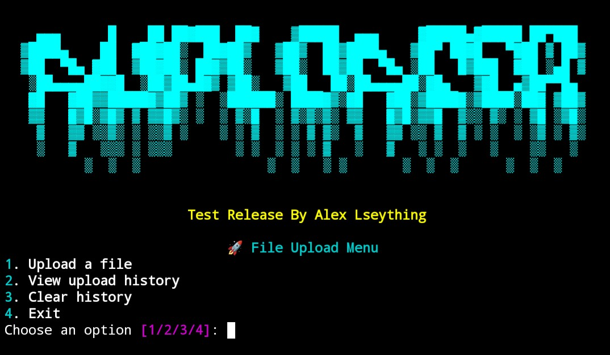
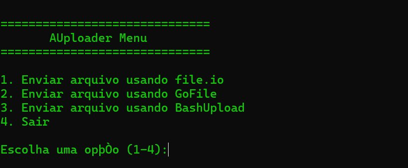

# AUploader Release by Alex Lseything

### Menu 1



This repository contains a Python script and exe named `AUploader` `AUploader.exe`, which performs a specific task. To ensure the script runs correctly, please follow the installation and execution steps below.

## Prerequisites

Before running the script, you need to have Python 3 installed on your system. If you don't have it yet, follow the instructions below to install it.

### Installing

1. **Windows:**
   - Visit the official Python website: [python.org](https://www.python.org/).
   - Download the latest version of Python 3.

2. **macOS:**
   - Python 3 can be installed via Homebrew. If you don't have Homebrew installed, run the following command in the terminal:
     ```bash
     /bin/bash -c "$(curl -fsSL https://raw.githubusercontent.com/Homebrew/install/HEAD/install.sh)"
     ```
   - Once Homebrew is installed, install Python 3 by running:
     ```bash
     brew install python
     ```

3. **Linux:**
   - Most Linux distributions come with Python 3 pre-installed. You can check if it's installed by running:
     ```bash
     python3 --version
     ```
   - If it's not installed, use your package manager to install it. For example, on Ubuntu or Debian:
     ```bash
     sudo apt update
     sudo apt install python3
     ```

## Dependencies

The script requires the following Python packages to be installed:

- `requests`
- `datetime` (usually included in Python's standard library)

To install the required packages, run the following command:

```bash
pip install datetime
pip install requests
pip install rich

## Running the Script

Once Python 3 is installed, follow these steps to run the script:

1. Clone this repository or download the `sender.py` file to your local machine.
2. Open a terminal or command prompt and navigate to the directory where the script is located.
3. Run the script using the following command:
   
and type >> ./AUploader or open AUploader.exe
